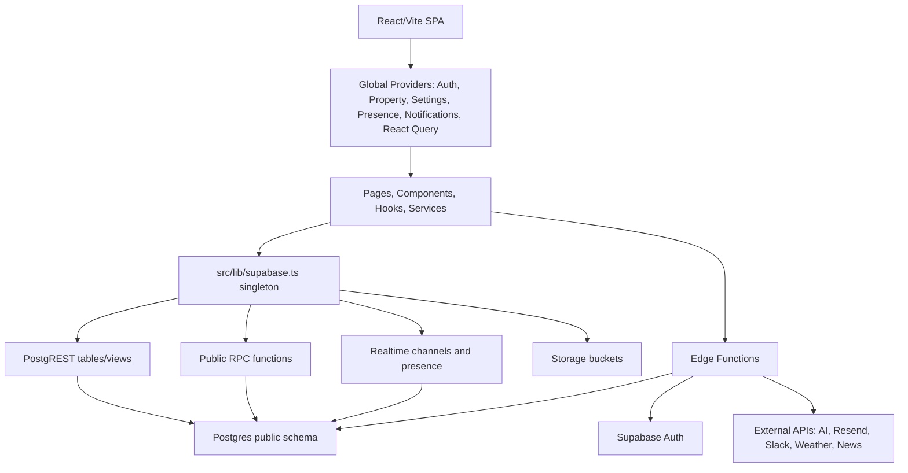
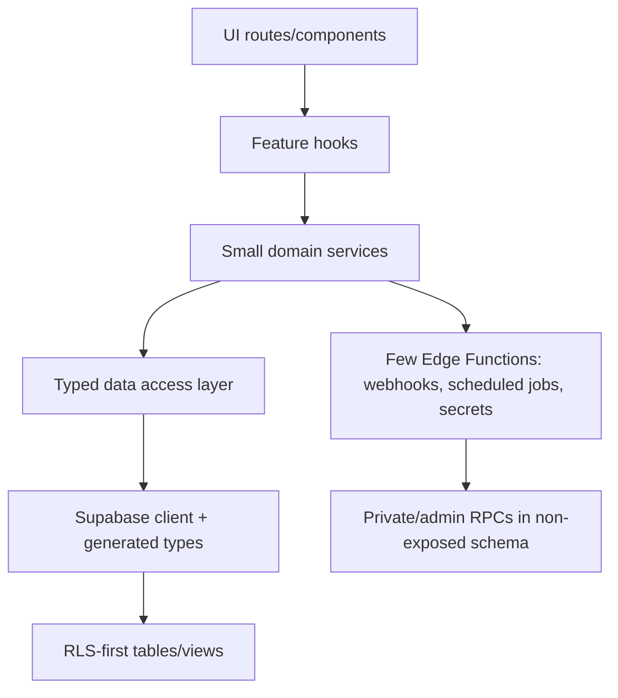
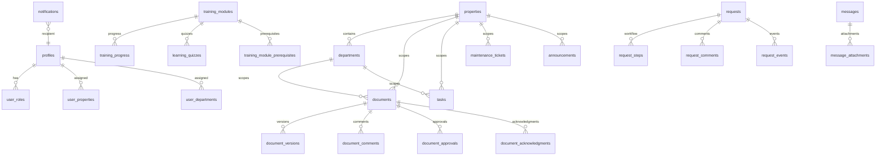

# Full Supabase System Audit - Altus Connect Intranet

Date: 2026-06-22  
Project: `connect v2` / Supabase ref `dhbfaclkfysqwfppuxxa`  
Audit scope: local repository, linked Supabase metadata, advisors, Postgres catalogs, Edge Functions, storage, RLS, dependencies, and validation commands.

## 1. Executive Summary

This application is functional, but its architecture has the classic signature of heavy vibe-coding: broad feature surface, too many direct database touchpoints, many security wrappers, a large number of RPCs, and large files that blend UI, orchestration, data fetching, and business logic.

The most important finding is not that the app lacks security work. It has a lot of security work. The problem is that the security model is overly complex and exposes too much privileged database code. The live database has `168` public tables and RLS is enabled on all of them, which is good. But it also has `248` public functions, `195` public `SECURITY DEFINER` functions, and every one of those `195` is executable by authenticated users. `9` privileged functions are executable by anonymous users.

Second, the deployed backend has drifted from the repository. The local repo has `29` Edge Function directories, but the live project has `49` active Edge Functions. Several deployed functions are not present in the local config or local function tree, including `ai-admin`, `ai-rollback-engine`, `security-monitor`, `apply-migrations`, `apply-slack-migration`, `password-reminders-test`, and `bulk-create-users`. This is a serious operational risk.

Third, the frontend talks directly to Supabase everywhere. Static scan found `157` table/view names referenced from frontend code, `104` RPC names, `19` Edge Functions invoked, and `307` broad `.select()` or `.select('*')` patterns. This makes RLS and RPC design do too much work and makes regressions hard to reason about.

Final health score: **52 / 100**

## 2. Architecture Diagram

Target architecture:

## 3. Evidence Snapshot

Local source:

- `842` source TS/TSX files.
- `29` local Edge Function directories.
- `32` active migration SQL files.
- `861` archived migration SQL files.
- `3` suspicious source artifacts: `src/components/knowledge/RelatedArticlesEditor.tsx.orig`, `src/pages/admin/RoleManagement.tsx.orig`, `src/hooks/useDashboardStats.ts.chunk.txt`.
- Largest files: `src/pages/training/TrainingPlayer.tsx` at `2204` lines, `src/pages/knowledge/KnowledgeEditor.tsx` at `2145`, `src/pages/knowledge/KnowledgeViewer.tsx` at `2087`, `src/pages/training/contexts/TrainingBuilderContext.tsx` at `2048`.

Supabase usage:

- `157` Supabase table/view names referenced from frontend code.
- Top table references: `documents` 119 calls in 47 files, `profiles` 92 calls in 54 files, `training_progress` 43 calls, `training_modules` 40 calls, `user_properties` 39 calls, `tasks` 39 calls.
- `104` RPC names referenced from frontend code.
- Top RPC calls: `create_notification`, `request_apply_action`, `complete_password_reset`, `approve_document_atomic`, `reject_document_atomic`, `update_request_details`.
- `19` Edge Functions invoked from frontend/local source.
- `307` broad `.select()` / `.select('*')` patterns.

Live database:

- `168` public tables.
- `168` public tables have RLS enabled.
- `0` public tables have forced RLS.
- `436` policies total across `public` and `storage`.
- `397` public policies.
- `39` storage policies, all on `storage.objects`.
- `133` public tables have estimated row count `0`.
- `248` public functions.
- `195` public `SECURITY DEFINER` functions.
- `195` public `SECURITY DEFINER` functions executable by `authenticated`.
- `9` public `SECURITY DEFINER` functions executable by `anon`.

## 4. Database ERD

This is a simplified relationship map. The actual database is much wider than this and should be split into bounded modules.

Relationship concern: many domains point back to `profiles`, `properties`, and `departments`, but the frontend often re-fetches those scope tables directly instead of going through scoped views or stable service queries. This causes duplicate authorization and data-shaping logic.

## 5. Security Report

### Critical: public `SECURITY DEFINER` surface is too large

Severity: Critical  
Evidence: Postgres catalog query found `195` public `SECURITY DEFINER` functions. All `195` are executable by `authenticated`; `9` are executable by `anon`. Supabase advisors also flagged public executable privileged functions.

Anonymous executable examples:

- `check_password_reuse(plain_password text)`
- `clear_failed_login_attempts(p_email text)`
- `complete_password_reset()`
- `is_task_creator(p_task_id uuid, p_user_id uuid)`
- `lock_account(p_email text, p_duration_minutes integer)`
- `log_pii_access(...)`
- `record_failed_login_attempt(p_email text)`
- `replace_workflow_steps(p_workflow_id uuid, p_steps jsonb)`
- `verify_certificate(verification_code_param character varying)`

Why it exists: RPCs are being used as an application service layer and as RLS escape hatches.

Why unnecessary: most helper functions should be either private, trigger-only, service-role-only, or plain invoker functions. A browser-callable public schema with hundreds of privileged functions is too large to audit safely.

Recommendation:

- Move privileged helpers into a non-exposed schema such as `private` or `app_private`.
- Revoke `EXECUTE` from `anon`, `authenticated`, and `public` by default.
- Grant only specific callable RPCs back to `authenticated`.
- Split browser-callable RPCs from trigger-only functions.
- Keep user-facing RPCs `SECURITY INVOKER` unless a specific RLS bypass is required and documented.

### High: public `pg_net` extension

Severity: High  
Evidence: Supabase security advisor: `pg_net` is installed in `public`.

Why it exists: likely used for scheduled jobs/webhooks.

Why unnecessary: exposed schema extensions increase API surface and make privilege mistakes easier.

Recommendation: move `pg_net` to an extension/private schema and update references.

### High: deployed Edge Function drift

Severity: High  
Evidence: live project has `49` active Edge Functions. Local repo has `29` function directories. Deployed-only functions include `ai-admin`, `ai-rollback-engine`, `security-monitor`, `ai-safety-validator`, `ai-policy-applier`, `apply-migrations`, `apply-slack-migration`, `bulk-create-users`, `daily-workflows`, and multiple password reminder/test functions.

Why it exists: ad hoc deployments without repository reconciliation.

Why unnecessary: production behavior cannot be reliably reviewed, reproduced, or rolled back from this repo.

Recommendation:

- Export or delete deployed-only functions.
- Make the repo the source of truth.
- Disable `apply-migrations` and `apply-slack-migration` unless there is a strict service-only scheduler path.

### Medium: unauthenticated Edge Functions need explicit webhook/auth proof

Severity: Medium  
Evidence: config marks these `verify_jwt=false`: `public-forgot-password`, `send-email`, `slack-commands`, `slack-events`, `slack-interactive`, `slack-training`.

Recommendation:

- Keep Slack webhook functions unauthenticated only if they verify Slack signatures.
- `send-email` should not be public unless it validates service-role/internal caller or enforces strict allowlists and rate limits.
- `public-forgot-password` is acceptable only with strong rate limiting and no account enumeration.

### Medium: auth leaked-password protection disabled

Severity: Medium  
Evidence: Supabase security advisor.

Recommendation: enable leaked password protection in Supabase Auth.

### Medium: production dependency vulnerabilities

Severity: Medium  
Evidence: `npm audit --omit=dev --audit-level=moderate` reports 4 moderate vulnerabilities:

- `dompurify <=3.4.10`
- `markdown-it <=14.1.1`
- `uuid <11.1.1` via `exceljs`

Recommendation:

- Run `npm audit fix` for non-breaking updates.
- Handle `exceljs`/`uuid` separately because `npm audit fix --force` proposes a breaking downgrade to `exceljs@3.4.0`.

## 6. RLS Report

Good:

- All `168` public tables have RLS enabled.
- All public views inspected are `security_invoker=true`, including audit, SOP, learning, media, and question compatibility views.
- Supabase docs currently recommend RLS on exposed schemas and `security_invoker=true` for views on Postgres 15+; the project follows that for views.

Risks:

- `0` public tables force RLS. In Supabase this is not always required, but for sensitive tables such as `profiles`, `mfa_secrets`, `payslips`, `documents`, audit logs, and account lifecycle tables it is worth evaluating.
- `analytics_events_insert` has `WITH CHECK (true)`, flagged by the Supabase security advisor.
- Many duplicate permissive policies are still present. Example tables: `storage.objects` has `39` policies; `temporary_approvers`, `training_assignment_rules`, `document_comments`, `learning_quizzes`, `shifts`, `documents`, `analytics_events`, `training_modules`, `user_departments`, `user_roles`, and `user_skills` have overlapping policies.

Correct implementation:

- Collapse policy sets by role and command.
- Prefer one policy per action per table unless there is a clear restrictive policy use case.
- Wrap stable auth helper calls as `(select auth.uid())` / `(select has_role(...))` where safe, matching Supabase RLS performance guidance.
- Index every column used in RLS joins and filters.

Policies safe to delete:

- None should be deleted blind from this audit alone.

Policies verify before delete:

- Duplicate permissive policies on `storage.objects`.
- `analytics_events_insert` if paired with `auth_insert_own_events`.
- Overlapping document select policies: `documents_select_by_visibility`, `documents_select_strict_visibility`, `documents_training_content_select`.
- Overlapping training policies: `property_isolation_training_modules` plus insert/update admin policies.
- Overlapping org policies on `user_roles`, `user_departments`, `user_properties`, `user_skills`.

## 7. Performance Report

### High: missing foreign key indexes

Severity: High  
Evidence: Supabase performance advisor and catalog query show many unindexed FKs. Examples:

- `announcement_acknowledgments.user_id`
- `announcement_comments.user_id`
- `announcement_reads.user_id`
- `attendance.property_id`
- `audit_findings.assigned_to`
- `audit_templates.property_id`, `department_id`, `created_by`
- `document_acknowledgments.user_id`
- `document_department_access.department_id`
- `documents.archived_by`, `subcategory_id`, `updated_by`
- `expense_claims.approved_by_id`, `department_id`, `rejected_by_id`, `workflow_request_id`
- `training_assignment_rules.assigned_by`
- `training_progress.training_id`
- `user_invitations.property_id`, `department_id`, `invited_by`

Recommended fix: add targeted FK indexes for non-empty or expected-growth tables first. Avoid indexing every empty table until the table survives cleanup review.

### High: too many broad frontend queries

Severity: High  
Evidence: `307` broad `.select()` / `.select('*')` patterns. Examples include `NotificationContext.tsx`, `PropertyContext.tsx`, `UserForm.tsx`, `JobPostingForm.tsx`, `TrainingCertificateGenerator.tsx`, and multiple large training/knowledge components.

Recommendation:

- Replace `select('*')` with narrow column lists.
- Add explicit filters matching RLS predicates.
- Introduce cursor-based pagination for growing lists.
- Keep analytics/reporting behind paginated RPCs or views.

### Medium: Realtime overhead

Severity: Medium  
Evidence: global notification, presence, sidebar counts, admin user management, and messaging listeners subscribe from app-wide contexts/hooks. Some listen to multiple tables on `*` events.

Recommendation:

- Keep: user-scoped notifications, direct messages, presence if it is a real product requirement.
- Replace: sidebar-count realtime with periodic polling or a single notification/event stream if badges are noncritical.
- Remove or gate: admin-wide user realtime unless the admin page is active.

### Medium: bundle weight

Severity: Medium  
Evidence: heavy dependencies include TipTap, Mermaid, PDF.js, jsPDF/html2pdf, ExcelJS, Recharts, Framer Motion, Lucide, React Query, Sentry, and i18n. Vite config manually chunks them, which is helpful but also evidence of bundle pressure.

Recommendation:

- Keep code splitting.
- Load document/export/editor/chart libraries only on feature routes.
- Remove unused heavy libraries after dependency verification.

## 8. Over-Engineering Report

### Auth context split is over-structured

Severity: Medium  
Evidence: `AuthProvider` composes `AuthIdentityProvider`, `AuthSecurityProvider`, `UserDataProvider`, `AuthActionsProvider`, plus a backward-compatible wrapper.

Why it exists: attempts to reduce rerenders and separate concerns.

Why it is unnecessary: the wrapper keeps the old all-in-one context alive, so consumers can still subscribe to everything. The split increases cognitive load without fully removing the original coupling.

Replacement: keep one public auth hook for app code and hide sub-contexts internally, or migrate callers fully to focused hooks and delete the compatibility layer.

### Security middleware and service duplication

Severity: Medium  
Evidence: large files: `src/lib/security-middleware.ts` 27 KB, `src/lib/security.ts` 21 KB, `src/lib/authSecurityService.ts` 33 KB, plus Supabase functions and DB RPCs implementing overlapping auth/security behavior.

Replacement: centralize security-critical checks in database policies and a small number of private RPCs. Keep frontend validation as UX only.

### Giant feature files

Severity: Medium  
Evidence: multiple files over 1000 lines. These are hard to test and easy for AI edits to damage.

Replacement: split by feature state, pure data access, presentation, and mutation handlers.

## 9. Dead Code Report

Safe to delete:

- `src/components/knowledge/RelatedArticlesEditor.tsx.orig`
- `src/pages/admin/RoleManagement.tsx.orig`
- `src/hooks/useDashboardStats.ts.chunk.txt`
- Empty active migrations after confirming they are not required by Supabase migration history: `20260612112211_storage_bucket_hardening.sql`, `20260613012459_extension_schema_and_rls_initplan_fixes.sql`, `20260613012502_revoke_anon_from_generate_verification_code.sql`

Verify before delete:

- Local Edge Functions not invoked by local frontend scan: `ai-document-tagger`, `approval-escalation`, `auto-analyze-feedback`, `fetch-news`, `resend-inbound-email`, `scheduled-reports`, `slack-commands`, `slack-events`, `slack-interactive`, `slack-training`. Some may be cron/webhook-only.
- Deployed-only Edge Functions. Either import them into the repo or delete from the live project.
- Public tables with estimated `0` rows. There are `133`; many represent speculative features such as audits, reports, workflows, training paths, queues, scheduled reports, or compliance modules.
- `supabase/migrations/archive` and `supabase/migrations_backup`. Keep only if they are intentional historical material; otherwise move to external documentation or remove from app repo.

Keep:

- `src/lib/supabase.ts` singleton client.
- Security-invoker compatibility views if frontend still references legacy names.
- `documents`, `profiles`, `properties`, `departments`, role/scope tables, notifications, training core, requests, and storage buckets that are actively referenced.

## 10. Dependency Report

Keep:

- `@supabase/supabase-js`, React, React Router, React Query, i18next/react-i18next, Tailwind/Radix stack, Zod, DOMPurify, PDF.js if document previews are required.

Verify before remove:

- `browserslist`, `caniuse-lite`, `core-js`, `@swc/helpers`: no source imports found.
- `react-error-boundary`: no source imports found, while custom error boundaries exist.
- `i18next-http-backend`: no source import found in static pass.
- `lottie-react`, `driver.js`, `react-confetti`, `react-lazy-load-image-component`, `mammoth`, `turndown`, `mermaid`, `html2pdf.js`, `jspdf`, `exceljs`: feature-specific, verify route usage and lazy loading before removing.

Do not remove only because static imports are zero:

- Build/dev packages such as TypeScript, Vite, ESLint, Tailwind, PostCSS, Vitest, jsdom, shadcn, Sentry Vite plugin, and type packages are used by tooling rather than app imports.

Packages requiring security updates:

- `dompurify`
- `markdown-it` transitive
- `uuid` transitive via `exceljs`

## 11. Edge Functions Report

Keep:

- `create-user`, `delete-user`, `admin-account-actions`: keep, but require admin checks inside function and service-role isolation.
- `public-forgot-password`: keep only with rate limits and no account enumeration.
- `process-ai-request`, `ai-translation`: keep if AI features are real; add usage quotas and audit logs.
- `image-proxy`, `weather-proxy`: keep if they protect API keys or normalize CORS.
- Slack functions: keep only if Slack signatures are verified.

Replace with SQL/RPC:

- Simple batch counters, status transitions, or document metadata updates should be SQL functions/triggers, not Edge Functions.

Remove or archive:

- Deployed-only AI/admin/rollback/policy applier functions unless there is a documented operator workflow.
- `apply-migrations` and `apply-slack-migration` from production unless locked to service-role-only scheduled infrastructure.
- `password-reminders-test` from production.

## 12. Storage Audit

Buckets:

- Public: `avatars`.
- Private: `documents`, `employee-documents`, `expense-receipts`, `maintenance-attachments`, `media`, `payslips`, `referral-cvs`, `reports-exports`, `requests`, `resumes`, `sop-attachments`, `task-attachments`, `training-content`.

Risks:

- `storage.objects` has `39` permissive policies. This is hard to reason about and likely redundant.
- Several buckets have no `file_size_limit` and no `allowed_mime_types`: `avatars`, `documents`, `maintenance-attachments`, `referral-cvs`, `resumes`, `sop-attachments`, `task-attachments`, `training-content`.
- `media` allows `image/svg+xml` and large `500 MiB` files. SVG is XSS-sensitive and should be sanitized or disallowed unless absolutely required.

Recommendation:

- Consolidate storage policies by bucket and operation.
- Set mime and size limits on every bucket.
- Prefer signed URL RPCs for private files.
- Add cleanup jobs for orphaned storage objects and verify they are not browser-callable.

## 13. Authentication Audit

Good:

- Single frontend Supabase client.
- HTTPS Supabase URL enforcement in `src/lib/supabase.ts`.
- Local session clear/recovery logic exists.
- JWT auto refresh and session persistence are enabled.
- Auth docs warning about user metadata is relevant; no obvious browser `service_role` exposure was found.

Risks:

- Auth state is split into many contexts plus a compatibility wrapper.
- `detectSessionInUrl` is disabled and auth flows are manually handled. That may be justified, but it increases reset/invite/callback bug risk.
- Password-reset/account-lock helper functions are public `SECURITY DEFINER` RPCs, including anon-executable functions.
- Leaked password protection disabled in Supabase.

Recommendation:

- Move password reset internals out of public schema.
- Keep only one public reset endpoint and one private DB helper.
- Enable leaked password protection.
- Add tests for reset, complete invite, MFA setup/verify, and expired session recovery.

## 14. Technical Debt Score

- Architecture: 48 / 100
- Database: 55 / 100
- Supabase usage: 46 / 100
- Authentication: 62 / 100
- Security: 50 / 100
- Performance: 54 / 100
- Maintainability: 44 / 100
- Scalability: 56 / 100
- Overall Health Score: 52 / 100

## 15. Refactoring Roadmap

### Priority 1: critical security fixes

1. Revoke public/authenticated execute from unnecessary `SECURITY DEFINER` functions.  
   Risk: Medium. Effort: 1-2 days. Impact: Critical.  
   Files/objects: public RPC grants, function schemas, frontend RPC callers.

2. Move privileged functions to `private` schema.  
   Risk: High. Effort: 3-5 days. Impact: Critical.  
   Objects: `195` public secdef functions, policies that call helpers.

3. Fix `analytics_events_insert` unrestricted policy.  
   Risk: Low. Effort: 1 hour. Impact: High.  
   Objects: `public.analytics_events`.

4. Move `pg_net` out of `public`.  
   Risk: Medium. Effort: 0.5-1 day. Impact: High.  
   Objects: extension schema, cron/webhook SQL.

### Priority 2: remove over-engineering

5. Reconcile live Edge Functions with repository.  
   Risk: Medium. Effort: 1-2 days. Impact: High.  
   Objects: 49 deployed functions, 29 local functions.

6. Delete source artifacts and empty migrations after migration-history confirmation.  
   Risk: Low. Effort: 1 hour. Impact: Medium.  
   Files: `.orig`, `.chunk.txt`, empty migrations.

7. Collapse duplicate storage policies.  
   Risk: Medium. Effort: 1-2 days. Impact: High.  
   Objects: `storage.objects` policies.

### Priority 3: simplify architecture

8. Introduce a thin typed data access layer for top 10 tables.  
   Risk: Medium. Effort: 3-5 days. Impact: High.  
   Files: documents, profiles, training, requests, tasks hooks/services.

9. Break giant pages into route container plus query hook plus view components.  
   Risk: Medium. Effort: ongoing. Impact: High.  
   Files: training player, knowledge editor/viewer, training contexts, data import, document library.

10. Replace broad `.select('*')` calls with explicit projections.  
    Risk: Low to Medium. Effort: 2-4 days. Impact: Medium.

### Priority 4: database cleanup

11. Add FK indexes for live/growing tables.  
    Risk: Low. Effort: 1 day. Impact: High.

12. Review 133 zero-row public tables and delete unused feature modules.  
    Risk: High without product owner. Effort: 2-4 days. Impact: High.

13. Consolidate duplicate permissive policies.  
    Risk: Medium. Effort: 2-5 days. Impact: Medium to High.

### Priority 5: performance optimization

14. Scope realtime to active routes and critical user events only.  
    Risk: Low. Effort: 1-2 days. Impact: Medium.

15. Add cursor pagination and count strategies for documents, audit logs, users, messages, tasks.  
    Risk: Medium. Effort: 2-4 days. Impact: Medium.

## 16. Quick Wins

- Delete `.orig` and `.chunk.txt` artifacts.
- Fix the three empty active migration files or remove them from active migration state after confirming history.
- Enable leaked-password protection in Supabase Auth.
- Add mime and size limits to unconstrained storage buckets.
- Revoke `anon` execute on the 9 privileged functions immediately, then test reset/certificate flows.
- Replace top-level `.select('*')` in `NotificationContext`, `PropertyContext`, and admin/user forms.
- Gate admin realtime subscriptions to admin routes only.

## 17. Critical Risks

- A browser-callable privileged RPC surface this large is not auditable at speed.
- Deployed Edge Functions not represented locally mean the repo is not the production source of truth.
- Empty active migrations indicate process drift.
- Storage object policies are too numerous to safely reason about.
- Many features are effectively scaffolds: 133 public tables have estimated zero rows.

## 18. Verification

Commands run:

- `npm run typecheck`: passed.
- `npm audit --omit=dev --audit-level=moderate`: failed with 4 moderate vulnerabilities.
- `npm run check:migrations`: failed due to 3 empty active migration files.

Supabase checks run:

- `list_edge_functions`
- `list_extensions`
- `list_migrations`
- `list_tables`
- `get_advisors` security and performance
- Postgres catalog queries for RLS, policies, functions, views, FK indexes, row estimates, and storage buckets.

Relevant Supabase documentation consulted:

- Row Level Security: https://supabase.com/docs/guides/database/postgres/row-level-security
- Database advisors and lints: https://supabase.com/docs/guides/database/database-advisors
