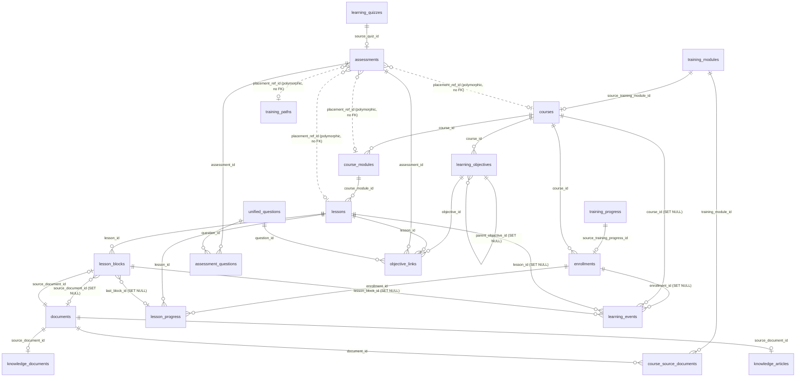

# Learning Domain Model Migration

Status: **files only — nothing applied.** Migrations `20260901080001`–`20260901080006`
plus the hand-run backfill `supabase/migrations/data/backfill_learning_domain.sql`.

This is the first structural step of the Training + Knowledge Base + Quiz pivot:
replace the two god-tables (`training_modules`, `documents`) and the flat
`training_progress` with a normalised learning domain, **additively**. Legacy
tables stay in place and keep serving the app until it is repointed.

---

## 1. New entities

| Table | Replaces / splits from | Purpose |
|---|---|---|
| `courses` | `training_modules` (1:1) | Top-level learning container. `source_training_module_id` UNIQUE = provenance. |
| `course_modules` | `documents.content_data.section_*` | Ordered section grouping lessons. `legacy_section_key` = old `section_id`. |
| `lessons` | (new layer) | Ordered lesson inside a `course_module`. Backfill creates one per section (`legacy_lesson_key='__section__'`). |
| `lesson_blocks` | `documents` where `content_type='training_block'` (263 rows) | Typed block (`text\|video\|image\|embed\|callout\|activity\|knowledge_check`) + JSONB `payload` + `position`. `source_document_id` UNIQUE = provenance. |
| `enrollments` | `training_progress` — identity + lifecycle + outcome | 1 row per `(user, course)`. `source_training_progress_id` UNIQUE. |
| `lesson_progress` | `training_progress` — per-lesson state | `(enrollment, lesson)` unique. |
| `learning_events` | `training_progress` — the mutated-in-place cursor/session/metadata columns | Append-only activity stream. |
| `assessments` | `learning_quizzes` (20 rows) | `formative\|summative`, `placement` enum `lesson\|module\|course\|path\|certification` + polymorphic `placement_ref_id`, `time_limit_minutes`, `max_attempts`, `passing_score`, `randomization` jsonb, optional pool binding (`question_bank_id` + `pool_draw_count`). `source_quiz_id` UNIQUE. |
| `assessment_questions` | `unified_quiz_questions` (mirror) | Explicit binding `assessment ↔ unified_questions`. Runtime delivery/grading is unchanged — still the `unified_*` engine. |
| `learning_objectives` | `training_modules.blueprint.{terminal,enabling}Objectives` | Measurable outcome, `terminal\|enabling`, course-scoped, self-hierarchical. |
| `objective_links` | (new) | M:N objective ↔ `lesson` \| `assessment` \| `question` (exactly-one-target CHECK). |
| `knowledge_documents` | `documents` where `content_type IN ('sop', file-backed 'document')` (~24 rows) | KB file / SOP record (~30 cols). |
| `knowledge_articles` | `documents` where `content_type='document'` with inline `content` | KB rich-text page. |
| `documents_sop_v` / `documents_article_v` | — | Backward-compat read-only VIEWS over `public.documents` by discriminator. |
| `course_source_documents` (extended) | — | `+ section_ref TEXT` for per-section attribution (`module:<id>` / `lesson:<id>` / `block:<id>` / NULL = course-level). UNIQUE swapped to `NULLS NOT DISTINCT (training_module_id, document_id, section_ref)`. |

Shared helper: `public.is_learning_editor(uuid)` — SECURITY DEFINER, pinned
`search_path`, true for `super_admin, corporate_admin, regional_admin,
regional_hr, property_manager, property_hr, department_head`. Used in every new
RLS policy. `public.learning_touch_updated_at()` drives `updated_at`.

RLS model on every new table: authenticated users read **published, non-deleted**
content (and learners read **their own** progress rows); `is_learning_editor()`
reads/writes everything; all `FOR ALL` write policies carry `WITH CHECK`.

---

## 2. FK graph

`placement_ref_id` is intentionally **not** a foreign key: the target table
varies by `placement`. Integrity is enforced in the application plus the
`assessments_placement_ref_present` CHECK (non-null for every placement except
`certification`).

---

## 3. Cutover plan

### Phase 0 — staging (this PR)
1. Apply `20260901080001`–`20260901080006` on **staging**. Verify `supabase db diff` is clean and advisors are green.
2. Run `supabase/migrations/data/backfill_learning_domain.sql` by hand. It is one transaction with row-count assertions; a shape drift rolls the whole thing back.
3. Spot-check: `courses` = non-deleted `training_modules`; `lesson_blocks` = `training_block` docs under those modules; `assessments` = non-deleted `learning_quizzes`; `enrollments` = resolvable `training_progress`.

### Phase 1 — dual-read in the app (separate PRs, `src/` only)
4. Point read models (Training Player, course lists, KB browser, quiz runner) at the new tables, falling back to legacy when a `source_*` provenance row is missing.
5. Regenerate `src/types/database.generated.ts` (`npm run db:types`).

### Phase 2 — dual-write
6. New authoring writes to `courses`/`course_modules`/`lessons`/`lesson_blocks`/`assessments` directly; a shim keeps `training_modules`/`documents` in sync until Phase 3 so nothing half-migrated breaks.
7. Progress writes go to `enrollments` + `lesson_progress` + `learning_events`; stop mutating `training_progress`.

### Phase 3 — flip
8. Backfill again for anything created during Phases 1–2 (the script is idempotent).
9. Make the new tables authoritative. Drop the sync shim. `documents_sop_v` / `documents_article_v` remain for any un-migrated reader.

### Phase 4 — retire (own migration, not this PR)
10. `training_block` rows deleted from `documents`; `training_modules`, `training_progress`, `learning_quizzes` renamed `*_legacy` for one release, then dropped.
11. `course_source_documents.training_module_id` repointed to `courses.id` (or a new `course_id` column added and the old one dropped).

### Rollback
Phases 0–2 are additive — drop the six migrations' objects (all `IF EXISTS`)
and the app keeps running on the legacy tables. After Phase 3, roll back by
re-enabling the sync shim and pointing reads back at legacy; the legacy tables
are still fully populated until Phase 4.

---

## 4. Deviations forced by the live schema (project `dhbfaclkfysqwfppuxxa`, 2026-09-01)

| Plan assumption | Reality | Resolution |
|---|---|---|
| "8 training_modules" | 7 non-deleted (`is_deleted=false`) | Backfill migrates the 7; assertion is `= non-deleted count`. |
| "263 training_block documents" | 263 total, but spread across **29** `training_module_id`s (most deleted/dangling) | Only the ~subset under the 7 live courses is migrated; assertion scopes to those. |
| training_block rows carry `content_data.lesson_id` / `section.id` | They carry `section_id` / `section_title` / `section_order` (flat keys) and **no lesson layer** | `course_modules` keyed on `section_id`; one synthetic lesson per section. |
| "training_progress → few hundred rows" | 15 rows, 11 resolvable to a live course | Fine; assertion is `= resolvable count`. |
| `learning_quizzes` all tie to a module | 5 of 20 have `training_module_id` | Unresolvable quizzes migrate as `placement='certification'` (ref-less) for manual re-placement. |
| Separate `article` discriminator in `documents` | Only `document` (12) and `sop` (12) | `knowledge_articles` = `document` rows with inline `content`; `knowledge_documents` = `sop` + file-backed `document` rows. Compat views split on `content_type` only. |
| repo has a shared `set_updated_at()` trigger fn | Only `handle_updated_at` / `update_updated_at_column` exist, inconsistently | Added self-contained `public.learning_touch_updated_at()`. |
| `scripts/check-migrations.mjs` committed | `scripts/` is `.gitignore`d repo-wide | Added the file locally so `npm run check:migrations` passes; it is not committed (matches existing `db:types` etc.). |
