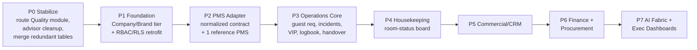

# §0 — Repo/Live Drift (read this first)

**db_schema.txt and the local `supabase/migrations/` folder do NOT reflect the live
database.** Confirmed by direct MCP query on 2026-07-21:

- **Live has tables not in `db_schema.txt` or any local migration file**, applied via
  30 migrations that exist in the live migration history but have no corresponding file
  in the repo (versions `20260613005832` → `20260627202806`, applied directly via
  Supabase MCP `apply_migration`, bypassing git). These added a real **Audit/Quality
  module** (`audit_templates`, `audit_runs`, `audit_items`, `audit_findings`,
  `audit_export_retention_policies`), a **Reporting subsystem** (`report_definitions`,
  `report_runs`, `scheduled_compliance_reports`, `scheduled_report_executions`),
  `expense_claims`, `analytics_events` (327 rows, actively used), `workflow_steps`,
  `task_templates`, and refinements to documents/training/announcements.
- **Conversely, 39 local migration files have no matching entry in the live migration
  history** — either superseded by differently-named live migrations covering the same
  ground, or never applied. Not yet reconciled file-by-file.
- **`approval_delegations` is already dropped live** (`drop_dead_approval_delegations`,
  version `20260614090216`) — the "3 overlapping delegation tables" finding in rev 1 is
  now **2 tables** (`admin_delegations`, `temporary_approvers`).
- **The entire SOP table family from rev 1 no longer exists live** (`sop_documents`,
  `sop_categories`, `sop_attachments`, `sop_approval_workflows`, etc. — ~18 tables). Only
  `sop_comments`/`sop_comment_votes` remain. Confirms the `20260613204841_
  consolidate_content_systems.sql` migration merged SOPs into `documents`
  (`content_type` discriminator) as reasoned in a prior session — this is now verified
  live, not inferred.
- **CLI reconciliation was attempted and blocked**: `SUPABASE_ACCESS_TOKEN` in the shell
  env has an invalid format and was shadowing a valid `sbp_...` token in
  `C:\Users\mahro\.supabase\config.json`. After unsetting it, `supabase migration list
  --linked` still failed (`401` on direct Postgres login) — CLI DB introspection needs a
  database password beyond the management-API token, which isn't available in this
  environment. **Recommendation:** either supply the DB password so `supabase db pull`
  can resync local migration files from live truth, or accept the MCP-first workflow
  (already the de facto pattern) and periodically snapshot live schema into the repo for
  audit purposes rather than treating `supabase/migrations/*.sql` as authoritative.
- **Practical implication for all work below:** treat the **live database via MCP** as
  the source of truth, not local files. Sections below have been corrected against live
  data. `db_schema.txt` should be regenerated or deleted — it now actively misleads.

---

# System Grounding Report

**Purpose.** Map what the `prime-hotels-intranet` codebase *already* does against the
Hospitality Operating System (HOS) vision, so every later build decision targets a real
gap instead of rebuilding working software. Every capability is tagged **EXISTS**
(shipped & usable), **PARTIAL** (started, incomplete/inconsistent), or **GAP** (absent).

> **Headline:** this is not a greenfield. It is a mature multi-property operations +
> knowledge + LMS + HR platform. The HOS work is (a) adding the **multi-company / brand
> hierarchy**, (b) a real **PMS integration layer**, (c) three missing operational domains
> (**Quality, Commercial/CRM, Procurement/Finance**), (d) hospitality-native **Operations**
> (guest requests, incidents, VIP, logbook, handover, housekeeping), and (e) elevating
> scattered AI features into a **role-scoped agent fabric**. The knowledge, training, HR,
> maintenance, workflow, and RBAC foundations are already strong.

## 1. Maturity heatmap (by HOS domain)

| HOS Domain | Status | Evidence (live DB, verified) | Biggest missing piece |
|---|---|---|---|
| Core Platform — identity/RBAC/notifications/audit/config | **EXISTS** | `profiles`, `user_roles`, `user_departments`, `user_properties`, `role_permissions`, `mfa_secrets`, `user_sessions`, `failed_login_attempts`; `notification_*` (10+ tables); `system_events` (588 rows, live), `analytics_events` (327 rows, live); `system_settings`; `admin/*` pages | **No `companies`/`brands` tier** above `properties` |
| Operations (hospitality-native) | **PARTIAL** | `operations/` = DailyFlashReport, OperationsDashboard, DataImport, **PMSConfiguration**; generic `requests`/`tasks`/`task_templates` engine | Guest requests, incidents, VIP, lost & found, digital **logbook**, **shift handover**, duty-manager report |
| Housekeeping | **GAP** | — (only `shifts`/`user_shifts`, not yet merged) | Room-status board, HK task assignment, PMS room-status sync |
| Engineering / Maintenance | **EXISTS** | `maintenance_tickets/comments/attachments/schedules`, `maintenance_sla_policies`; PreventiveMaintenance, SubmitTicket, TicketDetail, Dashboard | **Asset register**, utilities/**energy**, IoT hooks |
| **Quality / Audit** | **PARTIAL, further along than thought** *(revised — rev 1 said GAP)* | Live has `audit_templates`, `audit_runs`, `audit_items`, `audit_findings`, `audit_export_retention_policies`; `src/hooks/useAudits.ts` + `src/components/audits/AuditsControlCenter.tsx` are built and query real data | **Not registered in any route** (`src/routes/modules/AdminRoutes.tsx` has no audit-template path) — fully built but unreachable in the live app. Smallest possible win: wire up the route. |
| HR | **EXISTS** (deep) | attendance, leave_requests, payslips, performance_reviews, promotions, transfers, goals, EOM, referrals, onboarding, shift scheduling, **`expense_claims`** (new) | Payroll **integration** (data exists, no external sync); Saudization/Nitaqat reporting |
| Commercial (Sales/CRM) | **GAP** (unchanged) | — (only `events`, `hospitality_news`) | Accounts, leads, contracts, RFPs, marketing calendar, revenue meetings, CRM |
| Finance | **PARTIAL → stronger** *(revised)* | `payslips`, `salary_components`, **`expense_claims`** (new live table, no `MyExpenseClaims.tsx` UI confirmed wired to it yet — verify) | Budgets, forecasts, cost control, invoice workflows, approvals-for-spend |
| Procurement | **GAP** (unchanged) | — | Suppliers, purchase requests/orders, receiving, inventory, vendor evaluation |
| Projects (pre-opening/CAPEX) | **GAP** (unchanged) | generic `tasks`/`task_templates` only | Project templates, opening checklists, CAPEX tracking, renovation |
| Knowledge Management | **EXISTS** (deep) | `documents` + `document_*` (versions/approvals/acknowledgments/tags/**categories**/**feedback**/**bookmarks**); **SOP content now lives inside `documents` via `content_type`** — the old 20-table `sop_*` family is gone except `sop_comments`/`sop_comment_votes`; `system_wiki`; knowledge/* pages | Nothing structural; refine AI search |
| Learning (LMS) | **EXISTS** (deep) | `training_modules/paths/certificates`, `unified_questions/*` (quiz engine now fully unified — `quizzes`/`knowledge_questions`/`learning_quiz_questions` families are gone, consolidated), `training_module_prerequisites`, `training_certificate_settings`, `learning_assignment_exemptions/overrides` (new) | Consolidation debt narrower than rev 1 thought — mostly done live |
| **Reporting & Analytics** | **PARTIAL → real subsystem exists** *(revised)* | Live has `report_definitions`, `report_runs`, `scheduled_compliance_reports`, `scheduled_report_executions` — a real scheduled-reporting engine, not just ad hoc dashboards | Role-specific exec dashboards (CEO/COO/Owner); confirm frontend (`ReportBuilder.tsx`) is wired to these new tables |
| AI & Automation | **PARTIAL** | AI document tagger (edge fn), EmailWriter, AI-admin RPCs, `workflowEngine.ts`, `workflow_definitions/executions/schedules/**steps**` | **Role-scoped AI agents**, predictions, enterprise search |
| Workflow engine | **EXISTS** | `workflowEngine.ts`, `workflow_*` tables (now incl. `workflow_steps`), `approval_*`, `request_steps/sla_policies`, EscalationRules, SLASettings, DelegationSettings | Visual template builder; unify remaining **2** delegation tables (`approval_delegations` already dropped live) |

## 2. Cross-cutting foundations — the real spine work

These are the load-bearing gaps; most domain features depend on them.

### 2.1 Multi-company / brand hierarchy — **GAP (highest leverage)**
Today the org tree tops out at `properties`. The HOS vision requires
**Company → Brand → Region → Property → Department → Team → User**, with ownership and
RBAC filterable at every tier, multi-company isolation, and (later) franchise boundaries.
This touches RBAC, RLS on all 186 tables, and every report filter — so it must land
**before** new domains, not after. It is the single most expensive item to retrofit later.

### 2.2 PMS integration layer — **PARTIAL → needs real adapter**
`operations/PMSConfiguration.tsx` + `DataImport` + `DailyFlashReport` imply an
import/config-first approach, not a live adapter. HOS needs a normalized **PMS adapter
contract** (one internal interface; OPERA/Mews/Cloudbeds/etc. plug in behind it) covering
reservations, room status, folio/revenue reads. Everything hospitality-native
(housekeeping room status, guest requests, revenue dashboards) depends on this.

### 2.3 RBAC / RLS — **EXISTS but assumes single company**
Strong role model (`user_roles` + scope via `user_properties`/`user_departments`,
`has_role_optimized`, extensive RLS). The retrofit is adding the company/brand scope
dimension (see 2.1) and unifying the **three overlapping delegation tables**
(`admin_delegations`, `temporary_approvers`, `approval_delegations`).

### 2.4 AI fabric — **PARTIAL → productize**
Real AI features exist (tagging, email writing, admin RPCs) but not as governed,
role-scoped agents. Target: agents that never exceed the acting user's RBAC, ground on
platform data, log every action, and require human-in-the-loop for consequential actions.

## 3. Known technical debt

- **Build is GREEN as of 2026-07-21.** The previously-reported `learningService.ts:1111`
  type error (stale types for `training_progress`) no longer reproduces — `npm run
  typecheck` and `npm run build` both pass clean. The file is unchanged (`git diff` empty),
  so this was likely a stale/cached error from an earlier check, not a real regression.
  `src/types/database.generated.ts` was regenerated 2026-06-27 23:29 — same day as the
  live-only migrations — and is the actually-current generated-types source; `db_schema.txt`
  (captured 2026-06-14) is 13 days stale and should be deleted or regenerated.
- **Live security advisor: 0 errors, 236 warnings, all WARN-level.** No table has RLS
  disabled and no table has RLS-enabled-with-zero-policies (deny-all). Real open items:
  - **25 `SECURITY DEFINER` functions are executable by `anon`** (pre-auth). Most look
    intentional (password reset, certificate verification) but several warrant a manual
    check: `delete_operations_import`, `execute_scheduled_report`, `get_analytics_summary`,
    `get_daily_active_users`, `get_search_metrics`, `replace_workflow_steps`, and the
    `get_secure_*_url` family.
  - `analytics_events` INSERT policy `analytics_events_insert` has an always-true
    `WITH CHECK` — effectively bypasses RLS for inserts on that table.
  - `pg_net` extension installed in `public` schema (should move to `extensions`).
  - Auth setting: leaked-password (HaveIBeenPwned) protection is disabled.
- **Live performance advisor: 0 errors, 221 warnings (`multiple_permissive_policies`),
  444 info.** No RLS-initplan regressions (that prior fix held) and no missing-primary-key
  tables. Real open items:
  - **`shifts` (20 stacked-policy warnings) and `training_assignment_rules` (20)** are the
    clear outliers — a broad admin policy is layered on top of narrower CRUD policies
    instead of being merged into them, on every action. `documents` recurs across all
    three performance categories (unindexed FKs + stacked policies + 20 unused indexes) —
    highest-value single table to optimize.
  - **75 unindexed foreign keys** across 47 tables (full list in the advisor run); notably
    `training_progress.training_id`, `documents.{archived_by,subcategory_id,updated_by}`.
  - 369 unused indexes across 128 tables (INFO — low urgency, but worth a pass before P1
    adds more indexes on top).
- **Training/LMS consolidation is further along than previously tracked.** The old
  `quizzes`/`knowledge_questions`/`learning_quiz_questions`/`sop_quiz_*` families are now
  fully gone from the live schema, replaced by `unified_questions`/`unified_quiz_*`. The
  SOP document family (~18 tables) is gone too, merged into `documents` via `content_type`.
  This consolidation debt is smaller than rev 1 assumed.
- **Untyped Supabase client.** Generated DB types exist and are current, but the client
  isn't `createClient<Database>` yet — adopt incrementally.
- **Redundant tables to merge:** `shifts`/`user_shifts`; **2** delegation tables
  (`admin_delegations`, `temporary_approvers` — `approval_delegations` already dropped live).
- **Repo/live migration drift** — see §0. Treat live DB (via MCP) as source of truth.
- **Bundle:** heavy vendor libs now lazy-loaded (exceljs/pdfjs/mermaid/html2pdf) ✓.

## 4. Prioritized gap backlog (ranked by leverage × dependency, corrected 2026-07-21)

0. ~~Fix the build blocker~~ — **already green**, no action needed.
1. **Route the Quality/Audit module** — `AuditsControlCenter.tsx` + `useAudits.ts` +
   5 live tables already exist and work; just needs a route + nav entry. *Tiny — do first,
   real feature shipped same day.*
2. **Security/perf advisor cleanup** — audit the 25 anon-executable functions, fix the
   always-true `analytics_events` INSERT policy, consolidate stacked RLS policies on
   `shifts`/`training_assignment_rules`/`documents`, add the 75 missing FK indexes.
   *Small/Medium — improves the foundation everything else builds on.*
3. **Multi-company/brand hierarchy + RBAC/RLS retrofit** — foundational; do before new
   domains. *Large.*
4. **PMS adapter layer** (normalized contract + one reference integration). *Large.*
5. **Hospitality Operations core** — guest requests, incidents, VIP, lost & found,
   digital logbook, shift handover. Reuses the existing `requests`/workflow engine. *Medium.*
6. **Housekeeping** — room-status board on top of the PMS adapter. *Medium.*
7. **Wire `expense_claims` + `report_definitions`/`report_runs` fully into Finance/
   Reporting UI** — tables + hooks exist (`useExpenseClaims.ts`, `useReports.ts`,
   `useScheduledReports.ts`); confirm end-to-end UX is complete, not just plumbed. *Small.*
8. **Commercial / CRM** — accounts, leads, contracts, RFPs, revenue meetings. *Large.*
9. **Finance + Procurement (budgets, PO/receiving/inventory)** — expense claims exist;
   the rest doesn't. *Large.*
10. **AI agent fabric + enterprise search + exec dashboards.** *Medium/ongoing.*
11. **Projects / pre-opening / CAPEX.** *Medium.*

## 5. Recommended phased roadmap

- **P0 Stabilize** — route `AuditsControlCenter` into the app (real feature, near-zero
  cost); fix the always-true `analytics_events` RLS policy; audit the 25 anon-executable
  functions; consolidate stacked RLS policies on `shifts`/`training_assignment_rules`/
  `documents`; add missing FK indexes; merge `shifts`/`user_shifts` and the 2 remaining
  delegation tables; regenerate/delete stale `db_schema.txt`. *Success: Quality module
  live, security advisor warnings addressed, no redundant tables.* Quality is **removed**
  as its own later phase — it's already built, just needs P0's routing step.
- **P1 Foundation** — add `companies`/`brands`, extend scope model + RLS, migrate existing
  properties under a default company. *Success: a second company can be created and is
  fully data-isolated.*
- **P2 PMS Adapter** — internal contract + one live PMS (recommend Mews or OPERA per
  client's actual PMS). *Success: room status + reservations read live for one property.*
- **P3–P8** — the domain build-out above, each landing behind the P1 hierarchy and (where
  relevant) the P2 adapter, reusing the existing workflow/notification/RBAC engines.

## 6. Open decisions (feed §25 register when the full PRD runs)

1. **Which PMS integrates first?** Drives P2 entirely.
2. **Single-tenant per company vs shared multi-tenant with RLS isolation?** Drives P1.
3. **Managed properties only, or franchises too?** Changes the permission boundary model.
4. **Build BI in-app or export to Power BI?** Drives Reporting/Analytics.
5. **Data residency (KSA in-region) required now or at GCC expansion?** Drives infra.
6. **Historical-record retention** when merging redundant tables — compliance vs active-only.

## 7. Immediate next step

Build is already green — no blocker to fix. Recommend: (a) route the Quality/Audit module
(near-zero effort, ships a real feature today), (b) work through the security/performance
advisor findings in §3 (foundation cleanup, no user-facing risk), then (c) the **Company/
Brand hierarchy (P1)**, the most expensive item to retrofit and the dependency for every
later domain. On request, this report expands into the full 30-section PRD via
`docs/prd/MASTER_PROMPT.md`.

## 8. P0 execution log (2026-07-21, rev 3)

P0 was executed in this session — 4 parallel background agents on disjoint table scopes
plus the Company/Brand foundation built directly, each independently re-verified against
live DB state afterward (not just trusted from self-reports):

- **Quality module routed**: `/admin/quality-audits`, nav + EN/AR i18n added.
- **`shifts` + `user_shifts` merged** into `shifts` (7 stacked RLS policies → 4; both
  0-row tables, zero data-loss risk; 2 DB functions repointed).
- **`admin_delegations` + `temporary_approvers` merged** into new `delegations` table
  with a `delegation_category` discriminator (10 stacked policies → 4; 3 cross-table
  policies + 4 functions repointed; both were 0-row).
- **Security fixes**: always-true RLS bypass on `analytics_events` INSERT fixed; 10 of 25
  anon-executable `SECURITY DEFINER` functions had `anon`/`PUBLIC` execute revoked
  (verified via `has_function_privilege`, not just the `REVOKE` statement — 9 had granted
  to `PUBLIC`, which `anon` inherits, so a naive `REVOKE ... FROM anon` alone would have
  been a silent no-op). `pg_net` schema move is **not possible** (extension doesn't
  support `SET SCHEMA` — confirmed live). Leaked-password-protection toggle needs a
  manual Supabase dashboard action.
- **Performance**: `unindexed_foreign_keys` 75 → **0**. `multiple_permissive_policies`
  221 → 169 (remaining are on tables correctly left out of this round's scope — genuine
  backlog, not a regression). `training_assignment_rules`/`documents` policy bloat fixed.
- **P1 foundation landed** (additive-only, so nothing existing could break): `companies`
  + `brands` tables, nullable `company_id`/`brand_id` on `properties`, all 9 properties
  backfilled under one default company "Prime Hotels Group" (`PHG`). Minimal working
  frontend: `useCompanies.ts` + `/admin/companies` CRUD page. **The RBAC/RLS
  company-scoping retrofit itself is still open** — this round deliberately only added
  the hierarchy, it did not yet make existing policies company-aware.
- **Re-verified after all agents landed together**: `npm run typecheck` — 0 errors.
  Advisors re-run clean on both security and performance (0 ERROR-level either way).
- **Blocked, not attempted further**: `npm run db:types` — Supabase CLI auth fails on
  both the direct-Postgres (`--linked`) and Management-API (`--project-id`) paths; needs
  a fresh token from the dashboard. Low urgency since the app's Supabase client isn't
  `createClient<Database>` yet, so generated-type staleness has no runtime effect today.
- **False alarm during this round, resolved**: a table-count check mid-session appeared
  to show 189→168 tables (~21 "missing"). Cross-verified via `pg_tables` and
  `information_schema` independently — nothing was lost; 168 was correct all along, and
  the earlier "189" was an eyeball miscount of a long JSON blob (see §0's method note).

**Updated next step**: the harder half of P1 (making existing RLS policies
company/brand-aware across the ~168 tables, not just the new hierarchy tables) is now the
highest-leverage open item, followed by P2 (PMS adapter).
