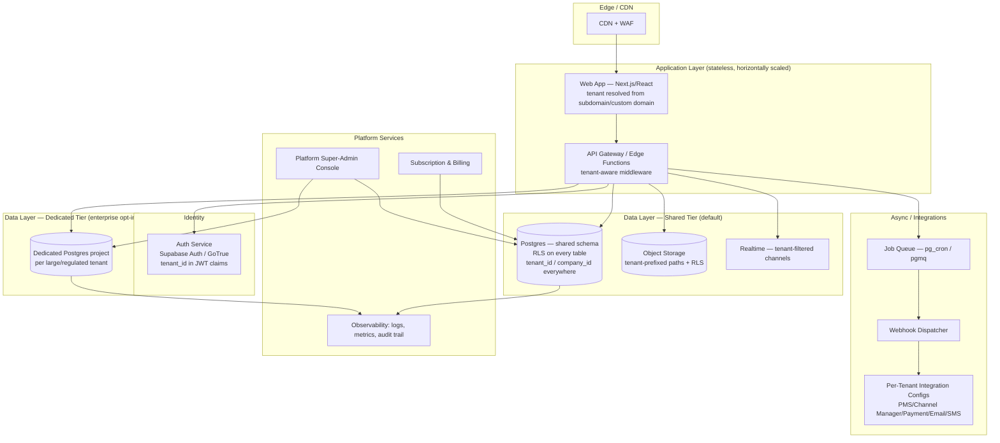
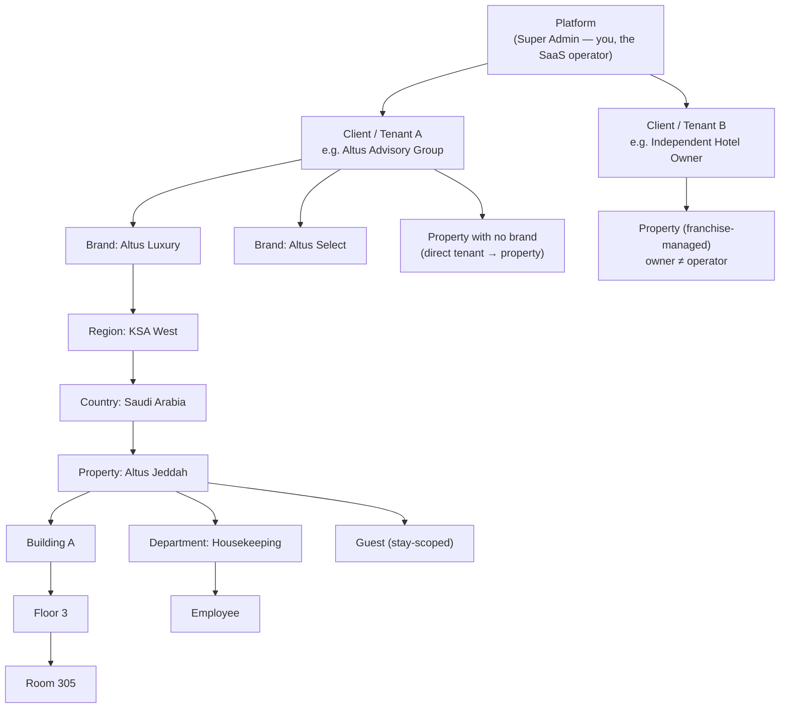
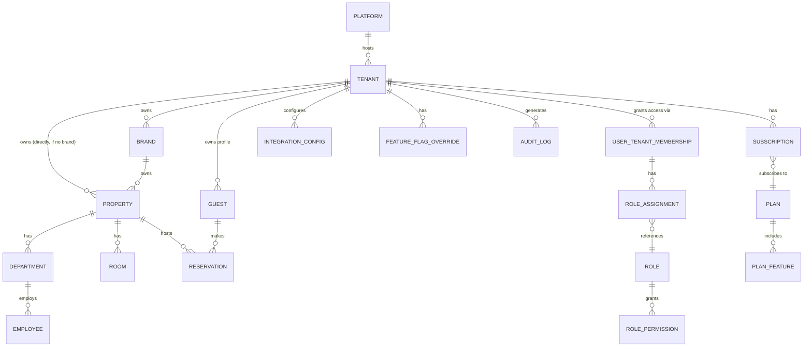
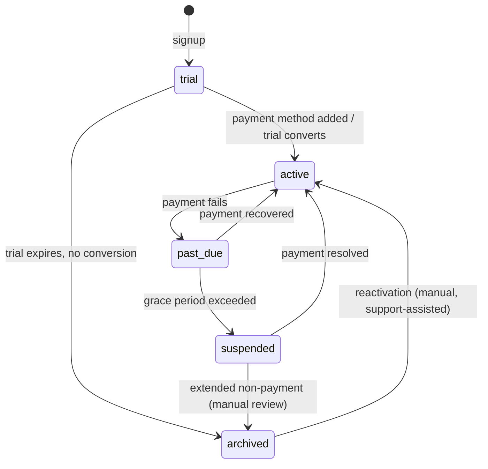

# Multi-Tenant SaaS PMS Architecture

## 0. Framing — read this before the rest

**What exists today is not what's being designed here.** As of this document, the
platform is a single hotel group's internal intranet: one seeded `companies` row ("Altus
Hotels Group"), 9 properties, and tenant isolation that exists structurally
(`properties.company_id`) but is only *enforced* at the admin-role layer (`user_companies`
opt-in scoping added recently). Every other role and every other one of the ~170 tables
still resolves access through `property_id` alone, with no company boundary.

What's being asked for here is a different product: **a true multi-tenant SaaS platform
that many separate, mutually-untrusting hotel companies pay to use**, where Client A must
never be able to see Client B's guests, staff, revenue, or configuration under any
circumstance — not "shouldn't," **can't**. That's a real architectural commitment (RLS on
every table, a tenant column everywhere, a provisioning/billing subsystem, a white-label
layer) not a checkbox. This document designs it properly. Section 10 (roadmap) is honest
about how much of it is new work versus extending what's already there.

---

## 1. Recommended Enterprise Architecture

### 1.1 Tenancy model — the central decision

| Model | Security | Performance | Scalability (1,000s of tenants) | Maintenance | Cost | Compliance | Backup/DR | Onboarding speed |
|---|---|---|---|---|---|---|---|---|
| **Shared DB, shared schema + RLS** | Strong *if* RLS is airtight; single blast radius if RLS has a bug | Excellent — one connection pool, one query planner, shared caches | **Best** — one schema migration deploys to all tenants at once | **Best** — one codebase, one migration pipeline | **Lowest** — no per-tenant infra | Meets most requirements (SOC2, ISO27001) with documented RLS controls; harder for tenants demanding physical data separation | One backup covers everyone; restore is all-or-nothing (mitigated with PITR + row-level export) | **Instant** — `INSERT INTO companies` and go |
| Shared DB, separate schemas per tenant | Strong, schema-level blast radius | Good, but connection/schema-search-path overhead grows with tenant count | **Poor beyond ~50-200 tenants** — migrations must fan out to every schema; `pg_dump`/monitoring tooling strains | High — N schemas to migrate, drift risk per schema | Medium — still one DB instance, but operational overhead per tenant | Easier "show me your isolated schema" story for auditors | Per-schema restore possible, but backup ops scale with tenant count | Minutes (schema clone), not instant |
| Separate database per tenant | Strongest physical isolation | Good per-tenant, but resource fragmentation (idle connections × N tenants) | **Fails at scale** — thousands of DB instances to patch, monitor, upgrade, back up | **Worst** — every migration is a fleet rollout | **Highest** — per-tenant compute/storage overhead, idle capacity waste | Best story for regulators requiring physical separation (rare for hospitality) | Fully isolated backup/restore per tenant | Slow — provisioning a DB is infra work, not a form submission |
| **Hybrid (recommended)** | Strong, tiered to tenant risk profile | Excellent for the 99% on shared tier | **Best** — shared tier scales normally; enterprise tier is opt-in and bounded | Low overhead — hybrid path only kicks in for a handful of large accounts | Efficient — you pay per-tenant infra cost only where a tenant's contract justifies it | Satisfies the rare enterprise/government client who contractually requires dedicated infrastructure | Standard shared-tier backup + dedicated backup for the enterprise minority | Instant for 99% of signups; provisioned onboarding for enterprise tier |

**Recommendation: shared database, shared schema, RLS-enforced isolation as the default
tier — with an opt-in "dedicated" tier (separate Supabase project or separate schema) for
large enterprise/regulated clients.**

Why this wins for "thousands of hotels": the economics and operability of per-tenant
infrastructure collapse well before you reach four figures of tenants. A schema
migration that takes 30 seconds against one shared database becomes an orchestration
problem against 2,000 schemas or 2,000 databases — you need a fleet-migration tool,
per-tenant health monitoring, and N× the connection overhead. Shared-schema-plus-RLS is
what most successful Postgres-native multi-tenant SaaS platforms run at this scale
(it's also literally what Supabase's own hosting model is built on). The trade-off is
that **RLS correctness becomes your single most important security control** — which is
why §5 treats it as a first-class subsystem with its own testing discipline, not "add a
policy and move on."

The **hybrid escape hatch** matters because your stated market (large international
hospitality brands) will eventually include a client whose procurement/compliance team
contractually demands a dedicated database or region. Design the platform so `companies`
carries a `tenancy_tier` (`shared` | `dedicated_schema` | `dedicated_project`) and a
`connection_override` — the application layer resolves which physical target to query
based on that flag. Build this switch on day one even though only "shared" ships in the
MVP; retrofitting a tenancy-tier abstraction after you have 500 shared tenants is far
more painful than building the seam up front.

### 1.2 High-level system diagram



---

## 2. Organizational Hierarchy



### 2.1 Level-by-level model and inheritance

| Level | Owns | Inherits from parent | Overrides allowed | Isolation boundary? |
|---|---|---|---|---|
| **Platform (Super Admin)** | Every tenant, global feature flags, plan catalog, platform-wide integrations (e.g. the payment processor *you* use to bill tenants) | — | — | N/A — this is the trust root |
| **Client/Tenant** | Subscription plan, billing, default branding, default policies, tenant-wide user pool, tenant-wide integrations catalog | Platform feature-flag defaults | Branding, locale defaults, tax defaults, security policy (MFA required, password policy, session timeout) | **Yes — the primary isolation boundary. Every row in every business table traces to exactly one tenant.** |
| **Brand** | Brand identity (logo, palette, domain), brand-wide policies, brand-wide reporting rollup | Tenant branding as default, can override every visual element | Logo, colors, fonts, email templates, guest-portal theme, service standards | No (same tenant) — but brand-scoped roles (Brand Director) don't see sibling brands under the same tenant unless explicitly granted |
| **Region / Country** | Regulatory config (tax regime, data-residency preference, currency default, Hijri/Gregorian calendar default), regional reporting rollup | Brand or tenant defaults | Tax rules, currency, legal entity, language default | No — organizational grouping, not a security boundary |
| **Property/Hotel** | Rooms, departments, staff, reservations, guests-in-house, local policies | Brand/tenant branding + policies unless overridden | Local operational config (check-in time, local tax add-ons, property-specific SOPs) | No (same tenant) — but this is the **primary RBAC scoping unit** below the tenant boundary (property-scoped roles never see other properties without explicit grant) |
| **Building / Floor** | Physical structure only — no independent policy | Property | — | No |
| **Room** | Room-status, room-type, maintenance history | Property, floor | Room-specific notes | No |
| **Department** | Staff roster, department-level task queues, department SOPs | Property | Department-specific workflows | No |
| **Employee** | Personal profile, role assignments (possibly across multiple properties/brands/tenants — see §4) | Department/property defaults for locale/timezone unless personal override | Personal notification preferences, language | **Employees belong to exactly one tenant as their employer, but a person can hold accounts across multiple tenants only as fully separate identities** (a consultant working for two hotel groups is two distinct user rows, not one row with cross-tenant roles — this is what makes "no client can ever see another client's data" actually true rather than aspirational) |
| **Guest** | Stay history, preferences, loyalty balance | Property (stay-scoped) or Tenant (loyalty-program-scoped, see §7) | — | Guest profiles are tenant-owned; a "shared guest profile across brands" (§7) is an explicit tenant-level opt-in, never automatic across tenants |

**Inheritance mechanics**: model this as a resolved-settings pattern, not literal
row-copying. A `settings` lookup for property P walks `property → brand → tenant →
platform`, taking the first non-null value at each key, with an explicit
`settings_overrides` table at each level rather than duplicating the full settings object
downward. This keeps a tenant-wide rebrand a single UPDATE instead of a fan-out write to
every property.

---

## 3. Tenant Isolation Strategy

The rule to build against: **every query, every file, every log line, every background
job either has no tenant context (platform-level) or exactly one tenant context — never
ambiguous, never optional.**

| Layer | Mechanism | Enforcement point |
|---|---|---|
| **Database access** | Every business table carries `company_id uuid NOT NULL REFERENCES companies(id)` (either directly or transitively via `property_id`). RLS policy on every table: `USING (company_id = current_tenant_id())` where `current_tenant_id()` reads from the JWT claim, never from a client-supplied parameter. | Postgres RLS — the database itself refuses cross-tenant rows even if application code has a bug. This is the load-bearing control. |
| **Authentication** | Supabase Auth issues a JWT per user; a **custom auth hook** injects `tenant_id` (and, if the user holds roles in more than one tenant — see below — the *currently selected* tenant) as a claim at token-mint time, sourced from a `user_tenant_memberships` table, never trusted from client input. | Auth hook (Postgres function invoked by GoTrue) + RLS reading `auth.jwt() ->> 'tenant_id'` |
| **Authorization (RBAC)** | Roles are always tenant-scoped rows (`user_id, tenant_id, role, scope_type, scope_id`), never global except the platform Super Admin role. A property-scoped role additionally checks `property_id` within the already-enforced tenant boundary. | RLS policies compose tenant check AND role/scope check — tenant check is never optional even when a role check also passes |
| **File storage** | Bucket paths are prefixed `{tenant_id}/{property_id}/...`; storage RLS policies parse the path prefix and compare to the caller's JWT tenant claim, mirroring the DB pattern. | Supabase Storage RLS on `storage.objects`, same `current_tenant_id()` helper |
| **Reports / exports** | Every report-generation job takes an explicit `tenant_id` parameter validated against the caller's JWT before any query runs; generated files inherit the storage-path prefix rule above. | Application-layer guard + storage RLS as defense-in-depth |
| **APIs** | Every API route resolves tenant context from the authenticated session (never from a URL param or request body field named `tenant_id` — client-supplied tenant IDs are a classic IDOR vector). Public/unauthenticated endpoints (guest booking widget) resolve tenant from the subdomain/domain instead. | Middleware that stamps a request-scoped `tenant_id` from session, then every downstream query uses it via RLS |
| **Audit logs** | `system_events`/audit tables carry `tenant_id` and are RLS-scoped identically to business data — a tenant admin can audit their own tenant's activity, never the platform's or another tenant's. Platform Super Admin audit access is a *separate*, more heavily logged path (auditing the auditors). | RLS + a distinct "break-glass" access pattern for platform staff, itself logged |
| **Backups** | Shared-tier backups are whole-database (point-in-time recovery); tenant-level restore is achieved via a documented row-level export/import runbook, not a routine capability — communicate this limitation in the SLA. Dedicated-tier tenants get isolated backups as part of what they're paying for. | PITR at the DB level; tested per-tenant logical export script |
| **Notifications** | Email/SMS/push dispatch jobs always carry `tenant_id` and pull tenant-specific sender identity (from-address, SMS sender ID) — never a shared platform "From" address for tenant-facing mail, which would leak platform branding into a white-labeled tenant's guest communications. | Notification dispatcher reads tenant's provider config (§6) before send |
| **Integrations** | Every third-party credential (payment gateway key, channel-manager token, PMS API key) is stored per-tenant in a secrets vault, never in shared environment variables. A webhook receiver validates the tenant context embedded in the callback URL/signature before processing. | Supabase Vault (or equivalent KMS) with per-tenant secret rows, RLS-scoped like any other tenant data; webhook URLs are tenant-unguessable (`/webhooks/stripe/{tenant_id}/{random_token}`) |

**Non-negotiable rule for engineers building on this platform**: no query against a
business table may ever omit the tenant filter "because RLS will handle it" as the *only*
line of defense for anything security-sensitive — RLS is the backstop, application code
should still scope explicitly, so a misconfigured policy fails closed (empty result) not
open (visible policy bypass via `SECURITY DEFINER` functions that forget to check tenant,
exactly the class of bug found and fixed twice already in this codebase's history).

---

## 4. Role & Permission Hierarchy (RBAC)

### 4.1 Role catalog

| Role | Scope level | Typical access |
|---|---|---|
| Platform Super Admin | Platform | Manage tenants, plans, platform integrations, impersonate (logged, time-boxed) for support |
| Client Owner | Tenant | Full control of their tenant: brands, properties, users, billing, branding, integrations |
| Brand Director | Brand | Cross-property visibility and policy control within one brand |
| Regional Manager | Region (a saved set of properties, possibly cross-brand) | Cross-property operational oversight within their region |
| Property General Manager | Property | Full operational control of one property |
| Department Manager | Department (within a property) | Manage their department's staff, tasks, schedules |
| Front Office / Housekeeping / Maintenance / Finance / Sales & Marketing / Revenue Manager | Department (within a property) | Role-specific operational functions, matching this repo's existing department-role pattern |
| Auditor | Tenant or Property (read-only) | Read access to audit logs, compliance reports, financial records — no write access anywhere |
| Guest | Self only | Their own reservations, folio, loyalty balance, preferences — never staff-side data |

### 4.2 Multi-scope membership

A person can legitimately hold different roles at different scopes simultaneously (a
Regional Manager who is also GM of their home property), and — separately — a person can
work for two different *tenants* (a consultant, or an owner with stakes in two unrelated
hotel groups). Model these as two different things:

- **Multi-scope within one tenant**: `user_role_assignments(user_id, tenant_id, role,
  scope_type ENUM('platform','tenant','brand','region','property','department'),
  scope_id)`. A user's effective permission at a given property is the union of every
  assignment whose scope contains that property (tenant-level Client Owner implicitly
  covers every property; a property-level assignment covers just that one).
- **Multi-tenant membership**: a *separate* `user_tenant_memberships` row per tenant,
  each with its own independent role assignments. The UI presents a "switch workspace"
  affordance (like Slack/Notion's multi-workspace model) rather than merging permissions
  — this is what keeps tenant isolation real: being a Client Owner at Tenant A grants
  **zero** implicit access at Tenant B, even for the same human being.

### 4.3 Permission model

Two layers, matching what this codebase already does well and extending it:

1. **Role → default permission matrix** (coarse-grained, e.g. "Front Office can
   create/read/update reservations, cannot delete, cannot access finance"), seeded per
   role and rarely edited per-tenant.
2. **Tenant-level permission overrides** (fine-grained, e.g. a specific tenant wants
   their Front Office role to also see rate plans) — stored as delta rows over the
   default matrix, exactly mirroring the existing `role_permissions` admin-editable table
   in this codebase, just with a `tenant_id` added so overrides don't leak between
   tenants.

---

## 5. Data Model

### 5.1 Core entity relationships



### 5.2 Key tables (illustrative DDL — Postgres/Supabase conventions matching this repo)

```sql
-- Tenancy root
create table tenants (
  id uuid primary key default gen_random_uuid(),
  legal_name text not null,
  trading_name text not null,
  slug text unique not null,                 -- subdomain: {slug}.yourplatform.com
  custom_domain text unique,                  -- optional white-label domain
  tenancy_tier text not null default 'shared' -- 'shared' | 'dedicated_schema' | 'dedicated_project'
    check (tenancy_tier in ('shared','dedicated_schema','dedicated_project')),
  dedicated_connection_ref text,              -- populated only for dedicated tiers
  status text not null default 'trial'
    check (status in ('trial','active','past_due','suspended','archived')),
  default_locale text not null default 'en',
  default_currency text not null default 'SAR',
  default_timezone text not null default 'Asia/Riyadh',
  created_at timestamptz not null default now(),
  updated_at timestamptz not null default now()
);

create table brands (
  id uuid primary key default gen_random_uuid(),
  tenant_id uuid not null references tenants(id),
  name text not null,
  slug text not null,
  branding jsonb not null default '{}',       -- logo_url, colors, fonts, email/sms templates
  unique (tenant_id, slug)
);

create table properties (
  id uuid primary key default gen_random_uuid(),
  tenant_id uuid not null references tenants(id),   -- denormalized for RLS simplicity, always matches brand's tenant
  brand_id uuid references brands(id),               -- nullable: independent, unbranded hotel
  ownership_model text not null default 'owned'
    check (ownership_model in ('owned','franchise','managed_for_owner')),
  region text, country text,
  name text not null,
  timezone text, currency text, tax_profile jsonb,
  created_at timestamptz not null default now()
);

-- Multi-tenant membership + RBAC
create table user_tenant_memberships (
  id uuid primary key default gen_random_uuid(),
  user_id uuid not null references auth.users(id),
  tenant_id uuid not null references tenants(id),
  status text not null default 'active' check (status in ('invited','active','suspended')),
  unique (user_id, tenant_id)
);

create table role_assignments (
  id uuid primary key default gen_random_uuid(),
  membership_id uuid not null references user_tenant_memberships(id),
  role text not null,                          -- 'client_owner' | 'brand_director' | ... (see §4.1)
  scope_type text not null
    check (scope_type in ('tenant','brand','region','property','department')),
  scope_id uuid,                                -- null when scope_type = 'tenant'
  created_at timestamptz not null default now()
);

-- Subscription & licensing
create table plans (
  id uuid primary key default gen_random_uuid(),
  code text unique not null,                    -- 'starter' | 'growth' | 'enterprise'
  max_properties int, max_rooms int, max_users int,
  price_monthly numeric, price_annual numeric,
  features jsonb not null default '[]'          -- array of feature keys included
);

create table subscriptions (
  id uuid primary key default gen_random_uuid(),
  tenant_id uuid not null references tenants(id),
  plan_id uuid not null references plans(id),
  billing_cycle text not null check (billing_cycle in ('monthly','annual')),
  current_period_start timestamptz, current_period_end timestamptz,
  status text not null check (status in ('trialing','active','past_due','canceled')),
  addons jsonb not null default '[]'
);

-- Integrations (per-tenant, credentials in vault, config here)
create table integration_configs (
  id uuid primary key default gen_random_uuid(),
  tenant_id uuid not null references tenants(id),
  property_id uuid references properties(id),   -- null = tenant-wide (e.g. accounting), set = property-specific (e.g. door locks)
  provider_type text not null,                   -- 'payment_gateway' | 'channel_manager' | 'pms' | 'pos' | 'door_lock' | 'crm' | 'email' | 'sms' | 'ai' | 'bi'
  provider text not null,                        -- 'stripe' | 'siteminder' | 'opera' | ...
  config jsonb not null default '{}',             -- non-secret config (endpoints, feature toggles)
  secret_ref text,                                -- pointer into vault, never the secret itself
  is_active boolean not null default true
);

-- Every business table follows this shape (example)
create table reservations (
  id uuid primary key default gen_random_uuid(),
  tenant_id uuid not null references tenants(id),   -- ALWAYS present, ALWAYS RLS-checked
  property_id uuid not null references properties(id),
  guest_id uuid not null references guests(id),
  -- ... reservation fields
  constraint reservations_tenant_matches_property
    check (tenant_id = (select tenant_id from properties where id = property_id))
);
```

### 5.3 Global vs. tenant-wide vs. brand-wide vs. property-specific data

| Data | Scope | Why |
|---|---|---|
| Plan catalog, platform feature flags, platform integrations (your own billing processor) | **Global (platform)** | Not tenant data at all — this is how you run the business |
| Tenant branding defaults, billing/subscription, tenant-wide integrations (accounting system), tenant security policy | **Tenant-wide** | One accounting system per hotel *company*, not per property |
| Brand identity, brand-wide dashboards, brand-wide loyalty tier definitions | **Brand-wide** | A guest's loyalty tier should be consistent across a brand's properties, not reset per hotel |
| Guest profile core identity (name, contact, loyalty balance) | **Tenant-wide (opt-in shared)** | See §7 — a guest who stays at two properties under the same tenant should be recognized, but this is a deliberate design choice each tenant can disable |
| Reservations, room inventory, rates, housekeeping tasks, maintenance tickets, staff schedules, local SOPs | **Property-specific** | Physical/operational reality is per-building |
| Cross-property/brand/tenant reports | **Computed, not stored** — a materialized rollup view scoped by the requester's own permission boundary, never a separately-stored "global" copy of property data | Prevents a reporting table from becoming an accidental cross-tenant leak |

---

## 6. White-Label & Branding Strategy

Branding resolves the same way settings do (§2.1): property → brand → tenant → platform
default, first non-null wins. Store it as one `branding jsonb` per level (not a rigid
column-per-property schema) so new brandable surfaces don't require a migration:

```json
{
  "logo_url": "...", "favicon_url": "...",
  "colors": { "primary": "#...", "secondary": "#...", "accent": "#..." },
  "fonts": { "heading": "...", "body": "..." },
  "domain": { "subdomain": "primehotels", "custom_domain": "connect.primehotels.com" },
  "email_templates": { "booking_confirmation": "template_id", "...": "..." },
  "sms_sender_id": "ALTUSHTL",
  "invoice_template": "template_id",
  "guest_portal_theme": "template_id",
  "staff_portal_theme": "template_id",
  "mobile_app": { "icon_url": "...", "splash_url": "...", "bundle_id_suffix": "..." },
  "locale": { "language": "ar", "rtl": true, "timezone": "Asia/Riyadh", "currency": "SAR" },
  "tax_rules": { "vat_rate": 0.15, "zatca_enabled": true }
}
```

**Custom domain routing**: tenant-facing surfaces (guest portal, booking widget) resolve
tenant context from the `Host` header at the edge (CDN/reverse-proxy layer) — map
`custom_domain → tenant_id` in a small lookup table cached at the edge, before the
request ever reaches the application, so a misrouted request can't leak into the wrong
tenant's session. Staff-facing surfaces can stay on `{slug}.yourplatform.com` — staff
don't need a custom domain, only guest-facing/public surfaces typically do.

---

## 7. Subscription & Licensing Model



- **Plans** gate on hard limits (`max_properties`, `max_rooms`, `max_users`) enforced at
  the write path (creating property #N+1 when the plan caps at N fails with a clear
  upgrade prompt, not a silent 500) and soft-gate on **feature flags**
  (`plans.features` / a `feature_flag_overrides` table per tenant for negotiated
  exceptions) — modules like Revenue Management AI, multi-currency, or the loyalty engine
  are flags, not separate codepaths, so enabling one for a tenant is a data change, not a
  deploy.
- **Usage metering**: track `rooms_count`, `active_users_count`, `properties_count` as
  materialized counts refreshed on write (trigger-maintained, not counted live on every
  request) so plan-limit checks are cheap.
- **Trial**: time-boxed (e.g. 14–30 days), full feature access at a capped scale (e.g. 1
  property, 20 rooms) so a prospect experiences the real product, not a crippled demo.
- **Suspension** must be a *reversible, non-destructive* state: a suspended tenant's data
  stays intact and RLS-visible only to that tenant's own users (read-only) plus platform
  support — suspension blocks new writes and guest-facing surfaces, it never deletes.
- **Archival** is the only state that should trigger eventual data lifecycle policies
  (export-then-purge after a contractually agreed retention window), and must be a
  deliberate, confirmed, logged action — never automatic.

---

## 8. Scalability & Security Best Practices

| Concern | Recommendation |
|---|---|
| **RLS** | Every table's policies follow one canonical helper pattern (`current_tenant_id()`, `has_property_access()` — extending what this repo already has), enforced via lint/CI check that fails a migration adding a table without RLS enabled. Treat RLS as code: policies reviewed, tested with a "tenant isolation test suite" that asserts Tenant A's session can never read/write Tenant B's rows, for every table, run on every schema change. |
| **Tenant-aware APIs** | Tenant context derived server-side from the session, never accepted as a client-supplied parameter (see §3). Rate limits and quotas are tenant-scoped, not global, so one noisy tenant can't degrade another's experience. |
| **Caching** | Cache keys always prefixed by `tenant_id` (`tenant:{id}:dashboard:...`); never share a cache entry across tenants even for "generic" data (a plan-catalog cache is fine to share since it's platform-global, but almost everything else isn't). |
| **Indexing** | Every RLS-filtered column (`tenant_id`, `property_id`) is indexed — RLS predicates are WHERE clauses under the hood and need the same index discipline as any hot filter. |
| **Rate limiting** | Per-tenant and per-user, at the edge/API-gateway layer, with stricter limits on unauthenticated tenant-resolution endpoints (guest booking widget) to blunt scraping/enumeration. |
| **Encryption** | Encrypt at rest (default with managed Postgres) and in transit (TLS everywhere); field-level encryption for the most sensitive PII (payment tokens — never store raw card data, always tokenize via the payment gateway) using the existing field-encryption pattern in this codebase. |
| **Secrets management** | Per-tenant integration credentials live in a vault (Supabase Vault or equivalent), referenced by pointer from `integration_configs`, never inlined in application config or environment variables. Platform-level secrets (your own infra credentials) are separate from tenant secrets and access-controlled separately. |
| **Monitoring** | Per-tenant health/usage dashboards for support and for the tenant themselves; platform-wide anomaly detection (e.g. sudden cross-tenant query pattern) as a security signal, not just an ops one. |
| **Audit logging** | Every privileged action (role change, integration credential change, data export, impersonation) logged with actor, tenant, timestamp, before/after — tenant-visible for their own tenant, platform-visible for everything (with impersonation itself always logged and time-boxed). |
| **Backups / DR** | PITR on the shared database (typically 7–35 days depending on plan); documented, *tested* per-tenant logical export/import runbook for the rare "restore just this tenant" request; dedicated-tier tenants get isolated backup schedules as a paid differentiator. |
| **High availability** | Standard managed-Postgres HA (primary + standby, automatic failover) covers the shared tier; stateless application layer behind a load balancer scales horizontally with tenant count, not per-tenant infrastructure. |

---

## 9. Administration Experience — Key Workflows

### 9.1 Onboarding a new client (end-to-end)

1. Prospect signs up (self-serve trial or sales-assisted) → `tenants` row created,
   `status = 'trial'`, plan defaults to the trial tier.
2. Platform sends a Client Owner invite to the signup email → they set a password / SSO,
   creating their `user_tenant_memberships` row with role `client_owner`.
3. **Guided setup wizard** (this is where most SaaS PMS onboarding either wins or loses
   the client in the first hour):
   a. Confirm/adjust tenant defaults: locale, currency, timezone, tax profile.
   b. Create first brand (optional — skip straight to property if unbranded).
   c. Create first property: name, address, room count, room types.
   d. Upload branding assets (logo, colors) — platform defaults apply until they do.
   e. Invite core team (GM, department heads) with role assignments.
   f. Connect at least one integration (commonly: payment gateway, or import from
      existing PMS/spreadsheet) — this can be deferred, but surface it prominently.
4. Trial countdown starts; in-app and email nudges toward adding a payment method before
   expiry; conversion to `active` on payment method confirmation.
5. Platform Super Admin console shows the new tenant in a "recent signups" queue for
   support/success-team follow-up, without needing to touch tenant data directly
   (impersonation is available but always logged and consent-gated).

### 9.2 Creating brands / adding properties / inviting users / assigning roles

All four are Client-Owner-or-higher self-service actions inside the tenant's own admin
console — no platform involvement required for routine growth. Each write is validated
against the subscription's `max_properties`/`max_users` before it's allowed to succeed,
with an inline upgrade prompt on rejection rather than a bare error.

### 9.3 Configuring branding / connecting integrations

Both are tenant-self-service settings screens. Integration connection follows an OAuth-
or-API-key flow scoped to that one tenant's `integration_configs` row; test-connection
and disconnect are always available; a disabled integration doesn't delete its config
(so re-enabling doesn't require re-entering credentials).

### 9.4 Managing subscriptions

Client Owner sees current plan, usage against limits, and can self-serve upgrade
(downgrade may require confirmation if it would drop below current usage — e.g. can't
downgrade to a 5-property plan while operating 8 properties without first archiving
some).

### 9.5 Offboarding / archiving

Explicit, confirmed, two-step (request → confirm after a cooling-off window) action by
the Client Owner or platform support. Triggers: immediate suspension of new activity,
data export offered/delivered, then archival per the retention policy in the contract —
never immediate hard deletion.

---

## 10. Common Pitfalls (and how this design avoids them)

| Pitfall | Why it happens | How this design avoids it |
|---|---|---|
| **Trusting a client-supplied tenant ID** | Convenient to just accept `?tenant_id=` in a request | Tenant context is always derived server-side from the session/JWT or the resolved domain — never accepted as input (§3) |
| **RLS policy that "forgets" the tenant check on one table** | Easy to miss when adding a new table under deadline pressure | CI-enforced rule: RLS-enabled-but-no-policy is a deploy blocker; a tenant-isolation test suite runs against every schema change |
| **`SECURITY DEFINER` functions that bypass RLS without their own auth check** | The exact bug class already found twice in this codebase's history this session | Every `SECURITY DEFINER` function gets an explicit internal authorization check as a checklist item in code review, not an assumption that RLS "covers" it |
| **Shared "From" address leaking platform branding into a white-labeled tenant's guest emails** | Notification sending defaults to a platform-wide sender | Notification dispatch always resolves the tenant's own sender identity first (§6) |
| **Global search/cache/report tables that accidentally aggregate across tenants** | Denormalizing "for performance" without carrying the tenant key along | Every derived/materialized table still carries `tenant_id` and is still RLS-scoped — performance optimizations never remove the isolation boundary |
| **Treating "separate schema per tenant" as a natural stepping stone that'll scale later** | Feels like a safer middle ground than shared-schema | It's actually a trap — it works fine at 20 tenants and becomes an operational nightmare at 500, forcing a harder migration later than building shared-schema-with-strict-RLS from the start |
| **No kill-switch for a single misbehaving tenant** | Multi-tenant systems assume good-faith tenants | Per-tenant rate limits and a `suspended` status that can be flipped without a deploy contain one tenant's incident (compromised account, integration gone rogue) from affecting others |
| **Onboarding wizard that requires talking to sales before a prospect sees real value** | Enterprise-first thinking applied to the whole funnel | Self-serve trial with a guided wizard (§9.1) for small/independent hotels; sales-assisted path coexists for the enterprise segment without gating the rest |
| **Impersonation without an audit trail** | Support needs to see what the tenant sees, quickly | Impersonation is a logged, time-boxed, tenant-visible event — never silent |

---

## 11. Phased Implementation Roadmap — MVP to Enterprise Scale

This explicitly maps onto where the codebase actually is today (§0), not a greenfield
timeline.

### Phase 0 — Foundation retrofit (before any new tenant can safely onboard)
- Rename the mental model: `companies` *is* `tenants` — formalize that in code/docs, add
  the `tenancy_tier` and `status` lifecycle columns from §5.2.
- Add `tenant_id`/`company_id` to every business table that doesn't already trace to one
  (today most trace via `property_id → properties.company_id`; make it a real,
  RLS-checked column, not an implicit join).
- Rewrite RLS across the ~170 existing tables to check tenant scope, not just property
  scope — this is the "harder half of P1" flagged repeatedly in this session's work, and
  it's the prerequisite for everything else in this roadmap.
- Build the tenant-isolation automated test suite (§10) before onboarding tenant #2 —
  retrofitting it after real second-tenant data exists is much riskier.
- **Success criterion**: a second real tenant can be created and its admin genuinely
  cannot see the first tenant's data through any surface, verified by the test suite, not
  by inspection.

### Phase 1 — Multi-tenant MVP
- Self-serve signup → trial → guided onboarding wizard (§9.1).
- Client Owner role + tenant-scoped user management (extends the existing RBAC).
- Basic branding (logo, colors, subdomain) — defer custom domains and full white-label
  email/SMS templating.
- One plan tier (no billing enforcement yet, or a manual/Stripe-Checkout-link stopgap).
- **Success criterion**: 5–10 pilot tenants running independently on shared
  infrastructure with zero cross-tenant incidents.

### Phase 2 — Subscription & licensing
- Full `plans`/`subscriptions` model, usage metering, plan-limit enforcement, self-serve
  upgrade/downgrade, trial-to-paid conversion flow.
- Suspension/reactivation lifecycle.

### Phase 3 — White-label depth
- Custom domains with edge-level tenant resolution.
- Full template control (email, SMS, invoice, guest portal, mobile app branding).
- Brand-level (not just tenant-level) branding for multi-brand tenants.

### Phase 4 — Per-tenant integrations marketplace
- Self-serve connect flows for payment gateways, channel managers, PMS/POS, door locks,
  CRM, email/SMS providers, AI, BI — each as an `integration_configs` row with vault-
  backed credentials (§5.2, §8).
- Webhook infrastructure with tenant-scoped, unguessable endpoints.

### Phase 5 — Cross-scope operational features
- Brand-wide and tenant-wide dashboards/rollups (computed, not duplicated — §5.3).
- Shared guest profiles and loyalty programs as an explicit tenant opt-in.
- Regional Manager cross-property scoping (extends the multi-scope RBAC from §4.2).

### Phase 6 — Enterprise tier
- `dedicated_schema` / `dedicated_project` tenancy tier for large/regulated clients.
- Per-tenant isolated backup schedules and SLAs.
- SSO/SAML for enterprise tenant identity federation.
- Advanced audit/compliance exports for enterprise procurement requirements.

### Phase 7 — Scale hardening
- Fleet-wide migration tooling proven at hundreds of tenants (even on shared schema,
  large tenant counts stress connection pooling, monitoring cardinality, and support
  tooling — this phase is about operating at scale, not new product features).
- Formal disaster-recovery drills, per-tenant logical restore runbook tested live.
- Expansion into resorts/serviced-apartments/vacation-rentals as new `property.type`
  variants riding the same tenant/brand/property spine — by this phase the hierarchy
  should already accommodate it without a schema redesign, which is the payoff of getting
  §2 and §5 right early.

**The one thing not to skip**: Phase 0. Every later phase assumes tenant isolation is
real, not aspirational. Building white-label branding, a billing system, or an
integrations marketplace on top of RLS that only *partially* enforces tenant boundaries
means every one of those features inherits the same isolation gap — better to spend the
time closing it once, at the foundation, than to discover it during a second tenant's
security review.
